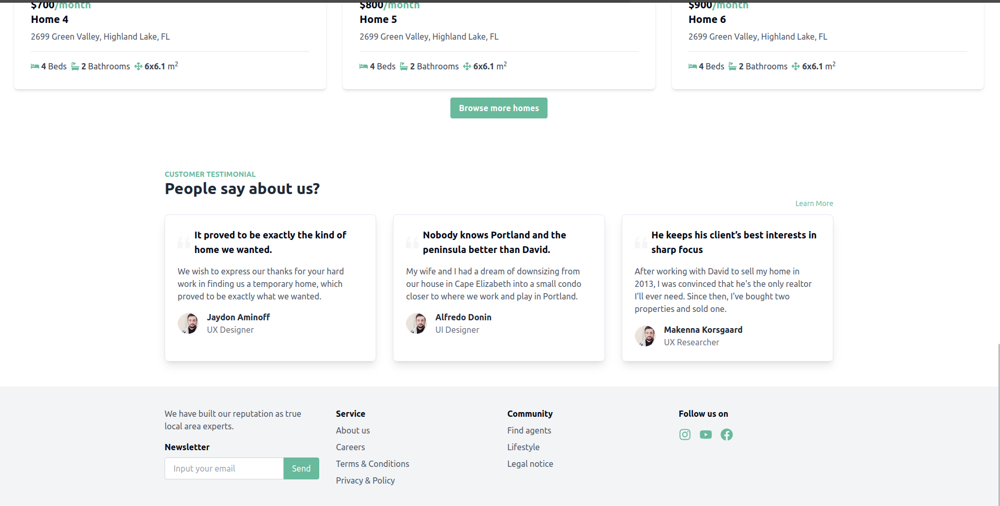

<div align="center">

  
  <h1>Live Dream</h1>
  
  <p>
    The right place to find your dream home! 
  </p>

  

<h4>
    <a href="https://real-estate-rental-system.vercel.app/">View Demo</a>
  <span> · </span>
    <a href="https://real-estate-rental-system.vercel.app/">Documentation</a>
  <span> · </span>
    <a href="https://real-estate-rental-system.vercel.app/"">Report Bug</a>
  <span> · </span>
    <a href="https://real-estate-rental-system.vercel.app/"">Request Feature</a>
  </h4>
</div>

<br />

<!-- Table of Contents -->
# Table of Contents

- [About the Project](#about-the-project)
  * [Tech Stack](#tech-stack)
  * [Features](#features)
  * [Color Reference](#color-reference)
  * [Environment Variables](#environment-variables)
- [Getting Started](#getting-started)
  * [Prerequisites](#prerequisites)
  * [Installation](#installation)
  * [Run Locally](#run-locally)
- [Usage](#usage)
- [Roadmap](#roadmap)
- [Contributing](#contributing)
  * [Code of Conduct](#code-of-conduct)
- [License](#license)
- [Contact](#contact)
- [Acknowledgements](#acknowledgements)
  

<!-- About the Project -->
## About the Project

<div align="center"> 
  
</div>


<!-- TechStack -->
### Tech Stack

<details>
  <summary>Client</summary>
  <ul>
    <li><a href="https://www.typescriptlang.org/">Typescript</a></li>
    <li><a href="https://ui.shadcn.com/">shad cn</a></li>
    <li><a href="https://reactjs.org/">React.js</a></li>
    <li><a href="https://vitest.dev/">Vitest</a></li>
    <li><a href="https://tailwindcss.com/">TailwindCSS</a></li>
  </ul>
</details>

<details>
  <summary>Server</summary>
  <ul>
    <li><a href="https://supabase.com/">Supabase</a></li>
  </ul>
</details>

<details>
<summary>Database</summary>
  <ul>
    <li><a href="https://www.postgresql.org/">PostgreSQL</a></li>
  </ul>
</details>

<details>
<summary>DevOps</summary>
  <ul>
    <li><a href="https://vercel.com/">Vercel</a></li>
  </ul>
</details>

<!-- Features -->
### Features

- User can create an account and login into the system
- Users can register their properties and manage it form there
- Users can create a post about a rent on the platform and get access to other peoples to rent there house
- Users can create a post to sell their house
- Users are able to get different houses for rent and properties
- Users have the ability to filter the properties with different parameters
- Users have their own profile which helps them to manage their contact information.

<!-- Color Reference -->
### Color Reference

| Color             | Hex                                                                |
| ----------------- | ------------------------------------------------------------------ |
| Primary Color |  #69B99D |
| Secondary Color |  #15803D |
| Text Color |  #FFFFFF |


<!-- Env Variables -->
### Environment Variables

To run this project, you will need to add the following environment variables to your .env file

`VITE_SUPABASE_URL`

`VITE_SUPABASE_ANON_KEY`

<!-- Getting Started -->
## Getting Started

<!-- Prerequisites -->
### Prerequisites

This project uses npm as package manager

<!-- Installation -->
### Installation

Install my-project with npm

```bash
  npm install my-project
  cd my-project
```


<!-- Run Locally -->
### Run Locally

Clone the project

```bash
  git clone https://github.com/TuringCollegeSubmissions/ezeben-WD.4B.4.4
```

Go to the project directory

```bash
  cd my-project
```

Install dependencies

```bash
  npm install
```

Start the development server

```bash
  npm run dev
```


<!-- Usage -->
## Usage

Live Dream is a platform that helps you find homes for both rent and purchase, and connects you with people directly, without the intervention of agents, which minimizes the costs you need to pay.

<div>
  
  
  
  
  
  
</div>

<!-- Roadmap -->
## Roadmap

* Implementation

<!-- Contributing -->
## Contributing


<!-- Code of Conduct -->
### Code of Conduct


<!-- License -->
## License

Distributed under the no License.


<!-- Contact -->
## Contact

Eyob Zebene - [@Eyob_Zebene](https://www.linkedin.com/in/eyob-zebene-b8359b21a/) - eyobzebene3580@gmail.com

Project Link: [https://github.com/TuringCollegeSubmissions/ezeben-WD.4B.4.4](https://github.com/TuringCollegeSubmissions/ezeben-WD.4B.4.4)

<!-- Acknowledgments -->
## Acknowledgements

Use this section to mention useful resources and libraries that you have used in your projects.

 - [Shields.io](https://shields.io/)
 - [Awesome README](https://github.com/matiassingers/awesome-readme)
 - [Readme Template](https://github.com/othneildrew/Best-README-Template)
